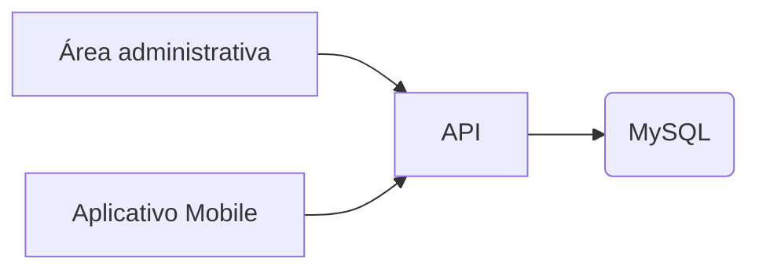

# belp-o

Bem-vindo ao repositório oficial do **BelPão**, o aplicativo da nossa padaria que conecta tradição e tecnologia para tornar sua experiência mais deliciosa e prática. Aqui você pode visualizar o cardápio, fazer pedidos, agendar retiradas e até receber em casa os melhores pães da cidade!

---

## 👨‍🍳 Sobre a BelPão
A Padaria BelPão é referência em qualidade e sabor desde 2024. Com o aplicativo, buscamos oferecer a mesma excelência da loja física em uma experiência digital intuitiva, prática e aconchegante — como o cheirinho de pão quente pela manhã. 🍞✨

---

## 📱 Funcionalidades

- 🥐 **Cardápio digital** com fotos e descrição dos produtos
- 🛒 **Pedidos online** com opção de entrega ou retirada
- 💳 **Pagamento integrado** via PIX, cartão ou na retirada

---

## 🚀 Tecnologias utilizadas

- Frontend: React Native
- Backend: Node.js / Express
- Banco de dados: MySQL, knex.js
- Autenticação: JWT (JSON Web Token)
- Integrações: Firebase, API de pagamento

---

## 🛠️ Como rodar o projeto localmente

```bash
# Clone o repositório
git clone https://github.com/MauricioCostaDaSilva/belp-o

# Instale as dependências do mobile
git clone https://github.com/MauricioCostaDaSilva/belp-o.git
cd belp-o/mobile/
npm install

# Instale as dependências do backend
cd ../server/
npm install

# Inicie o app mobile (Expo)
cd ../mobile/
npx expo start
```

---

## 🗂️ Estrutura do Projeto

```
belp-o/
├── mobile/           # Aplicativo mobile React Native
│   ├── src/
│   │   ├── api/      # Funções de acesso à API
│   │   ├── views/    # Telas do app
│   │   └── ...
│   └── assets/       # Imagens e recursos
├── server/           # Backend Node.js/Express
│   └── src/
└── banco_de_dados.sql
```

---

## 📦 Dependências principais (mobile)

```bash
npm install @react-native-async-storage/async-storage react-native-paper react-router-native
```

---

## 🗺️ Diagrama de arquitetura



---

## 🤝 Contribuição

- [Diego Matos](https://github.com/dazevedoti)
- [Jessica Carvalho](https://github.com/Jcaroliver02)
- [Juan Dos Anjos](https://github.com/juananjos)
- [Mauricio Costa](https://github.com/MauricioCostaDaSilva)
- [Yan Silva](https://github.com/YanS2D)

---

## 📄 Licença

Este projeto está sob a licença MIT. Veja o arquivo LICENSE para mais detalhes.


